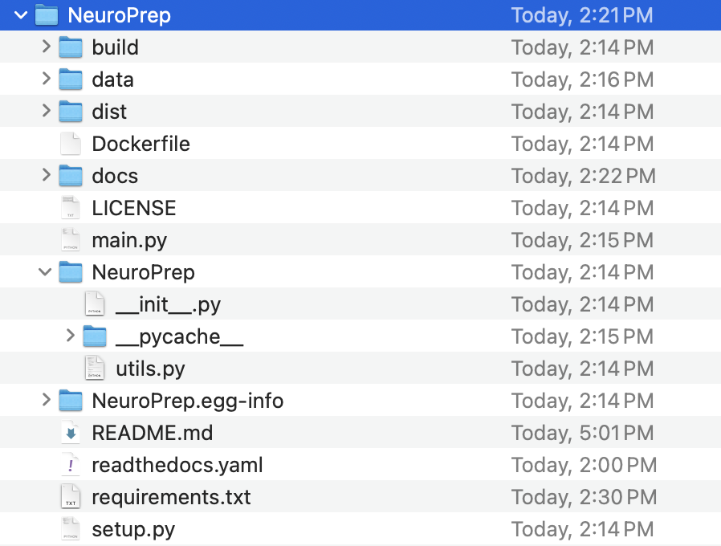

# Reproducible Project Management

Reproducible project management is the cornerstone of efficient and transparent workflows in the development and collaboration world. It involves implementing practices and utilizing tools that ensure the consistent and reliable reproduction of project results. To ensure reproducibility, creating and publishing packages, and open-source documentation play a key role. In this hands-on session, I will walk you through open-sourcing Python projects with GitHub, publishing packages online through PyPI (Python Package Index), dockerization, and creating detailed documentation with Read the Docs.


## Getting started

The following frameworks are needed to work with this project.
 ### Softwares Installations
```
$ git clone https://github.com/brainhack-vandy/NeuroPreprocessing.git
$ Visual Studio Code installation
$ Docker Desktop installation
$ Python or Anaconda environment
$ pip install numpy nilearn setuptools wheel and twine sphinx sphinx_rtd_theme 
```

#### Accounts needed

```
$ GitHub (https://github.com)
$ Python Package Index (PyPI) (https://pypi.org). Make sure that you genearte API token and save it on your machine
$ Read the Docs (https://readthedocs.org)

```

## Develop an fMRI preprocessing pipeline

We will be using part of our fMRI preprocessing tool, NeuroGraph (https://neurograph.readthedocs.io/en/latest/) that provides a set of tools for downloading, preprocessing and creating graph-based representations and benchmarks. We will use Python programming language. Our project structure is as follows. 





